# PowerSense-Report

# Capítulo IV: Product Design

## 4.1. Style Guidelines.
### 4.1.1. General Style Guidelines.
#### Branding – PowerSense

#### Brand Overview
**PowerSense** es una plataforma **IoT “verde”** para **hogares y PYMEs** que permite **monitorear y optimizar** el consumo eléctrico en tiempo real. Integra **sensores y actuadores inteligentes** con **IA** para detectar ineficiencias, recomendar acciones y automatizar encendidos/apagados, reduciendo **costos** y **huella de carbono**. Se posiciona como una solución **confiable, moderna y accesible** para Lima y, progresivamente, Sudamérica.

#### Misión
Empoderar a hogares y PYMEs para **gastar menos energía** sin perder confort ni productividad, ofreciendo herramientas simples, basadas en **datos reales**, que conviertan el consumo eléctrico en **ahorros medibles**.

#### Visión
Ser la **plataforma líder en Sudamérica** en **eficiencia energética inteligente**, impulsando ciudades más sostenibles mediante tecnología IoT y analítica clara y accionable.

#### Brand Name
**PowerSense** combina *Power* (energía) y *Sense* (sensar/entender): **medir, comprender y optimizar** el uso de la energía de forma simple y automatizada.

#### Logotipo


#### Colores (HEX)

> Paleta orientada a sostenibilidad y claridad de lectura; acentos verdes para acciones clave y **violeta muy claro** para superficies suaves.


### Principales
- **Primary / Verde Power:** `#48AF6A`  
- **CTA / Verde Acción:** `#46AE09`  
- **Base / Blanco:** `#FFFFFF`

### Secundarios & Superficies
- **Superficie Suave (violeta muy claro):** `#E6E9F7`  
- **Verde Suave Acento:** `#DCEED4`  
- **Verde Pastel Acento:** `#C1E4AD`

### Interacción & Links
- **Link / Menú Verde:** `#60B92B`

### Texto
- **Heading / Verde Muy Oscuro:** `#112310` (alt. `#1E301F`)  
- **Copy / Gris Párrafo:** `#616E67` (alt. `#6E7672`)  
- **Texto invertido (sobre CTA/oscuro):** `#FFFFFF`

#### Tipografía


**Familia:** **Inter** (sans-serif), por su legibilidad y neutralidad en interfaces.

### Jerarquías

| Jerarquía             | Tamaño | Altura de línea | Peso     | Uso sugerido |
|-----------------------|:------:|:---------------:|----------|--------------|
| Heading 1             | 48 px  | 60 px           | Bold     | Héroe, métricas clave |
| Heading 2             | 32 px  | 42 px           | Semibold | Secciones |
| Heading 3             | 20 px  | 30 px           | Medium   | Subsecciones, cards |
| Heading 4             | 16 px  | 24 px           | Medium   | Etiquetas, mini-títulos |
| Large Text Bold       | 20 px  | 30 px           | Bold     | KPIs/llamadas |
| Medium Text Regular   | 18 px  | 28 px           | Regular  | Párrafos destacados |
| Normal Text Regular   | 16 px  | 24 px           | Regular  | Párrafo base |
| Small Text Regular    | 14 px  | 20 px           | Regular  | Ayudas, disclaimers |

**Aplicación de color tipográfico**
- Títulos: `#112310`  
- Párrafos: `#616E67`  
- Enlaces: `#60B92B`  
- Texto en CTA/superficies oscuras: `#FFFFFF`


#### Spacing & Layout

Sistema modular **8 px**:
- **Secciones:** 32 px  
- **Padding contenedores:** 24 px  
- **Gap entre controles:** 16 px  
- **Padding interno de tarjetas:** 12 px  

**Superficies recomendadas**
- Fondo principal: `#FFFFFF`  
- Tarjetas / bloques destacados: `#E6E9F7`  
- Secciones alternas: `#DCEED4`, `#C1E4AD`


#### Tono de comunicación
- **Personalidad:** Profesional, cercana y orientada a impacto.  
- **Tono emocional:** Optimista y responsable (ahorro + sostenibilidad).  
- **Lenguaje:** Claro, directo.  
- **Relación con el usuario:** Didáctica y empática, enfatizando **ahorro** y reducción de emisiones.


#### Uso rápido (componentes)

- **Botón primario (CTA):** fondo `#46AE09`, texto `#FFFFFF` (hover: oscurecer 8–12%).  
- **Botón secundario:** borde `#48AF6A`, texto `#48AF6A`, fondo `transparent` (hover: `#DCEED4`).  
- **Card:** fondo `#E6E9F7`, títulos `#112310`, texto `#616E67`.  
- **Links / Nav:** `#60B92B` con subrayado al hover.  
- **Badges / Chips:** fondo `#C1E4AD`, texto `#112310`.


### 4.1.2. Web Style Guidelines.

Para el estilo principal en el cual se va a enfocar la aplicación web y la landing page son:

- Diseño minimalista y colorido La aplicación tendrá un tono minimalista para evitar llenar de información al usuario como excesiva cantidad de elementos en pantalla.

- Imágenes ilustrativas Para mostrar el uso de las imágenes optamos por usar ilustraciones en cambio de las imágenes estilo fotografía, ya que estas encajan perfecto con el estilo minimalista y además de una mayor personalización.

- Elementos intuitivos de interacción Los elementos de nuestra aplicación son intuitivos para brindar una mayor experiencia de usuario. Cabe recalcar que la mayoría de estos elementos estarán resaltados con los colores primarios y secundarios.

- Contraste de colores Para una mayor redacción de la aplicación, tomamos en cuenta el nivel de contraste entre dos o más elementos.

## 4.2. Information Architecture.

### 4.2.1. Organization Systems.

En cuanto al sistema de organización del contenido, se optó el patrón jerárquico (visal hierarchy) para organizar la información de las secciones. El tamaño de las fuentes es crucial para el usuario, donde la información más importante serán desde los textos más grandes hasta los más pequeños.

Por otro lado, se utiliza categorización por audiencia para dirigirnos a postulantes y profesionales de recursos humanos, con secciones específicas para cada uno. Además, se implementa orden cronológico descendente en las entradas de la base de datos, priorizando las más recientes al principio para facilitar la consulta de los usuarios.

### 4.2.2. Labeling Systems.

Para el contenido, se prioriza la reducción de textos para brindar una mejor redacción y legibilidad de estos para los usuarios.

Para el uso de botones se ha optado por un estilo minimalista, donde se usarán los colores primarios como fondo y bordes redondeados.

En el tema de iconos, se emplean los colores creados del sistema de diseño del equipo.

### 4.2.3. SEO Tags and Meta Tags

```html
<head>
    <meta charset="utf-8" />
    <title>PowerSense-LandingPage</title>
    <base href="/" />
    <meta name="viewport" content="width=device-width, initial-scale=1" />
    <meta name="theme-color" content="#4051b5" />
    <link rel="icon" type="image/x-icon" href="favicon.ico" />
    <link
      href="https://fonts.googleapis.com/icon?family=Material+Icons"
      rel="stylesheet"
    />
</head>
```

### 4.2.4. Searching Systems.

#### Estructura de Navegación Principal

La navegación de PowerSense está diseñada para guiar al usuario de forma clara e intuitiva por la landing page, facilitando el acceso a la información más relevante.

##### 1. Navegación de la Landing page 
Sección principal de la página, ubicada en la parte superior. Incluye el logotipo y el menú de navegación que permite moverse rápidamente a las secciones clave.
- **Logo PowerSense** → Enlace a inicio  
- **Menú Principal:**  
  - Inicio → Scroll a sección *Hero*  
  - Cómo Funciona → Scroll a sección *Proceso 4 pasos*  
  - Casos de Éxito → Scroll a *Testimonios y casos*  
  - Planes → Scroll a *Precios y suscripciones*  
  - Contacto → Scroll a *Formulario de contacto*  
  - Sobre Nosotros → Scroll a *Información de empresa*  

##### 2. Navegación de la Web Application

**Aplicación Web:**
- **Menú lateral (sidebar):** Incluye accesos a secciones principales como Dashboard, Explorar, etc.
- **Barra superior:** Muestra íconos de notificaciones, ayuda y perfil de usuario.
- **Breadcrumbs:** Presentes en vistas secundarias para mantener contexto.
- **Componentes interactivos:** Botones, tarjetas, chips y enlaces mantienen consistencia en color y comportamiento.

#### Técnicas de Navegación Implementadas

En esta sección se describen las técnicas que mejoran la experiencia de desplazamiento del usuario dentro de la landing page.

##### 1. Scroll Suave (*Smooth Scrolling*)
Permite que el movimiento entre secciones sea fluido y agradable para el usuario.  
- Transiciones fluidas entre secciones  
- Duración: **300ms** con *easing* personalizado  
- Comportamiento: `scroll-behavior: smooth`  

##### 2. Navegación por Anclas
Cada enlace del menú se conecta con una sección específica de la página mediante identificadores únicos.  
- Cada sección tiene un **ID único** (`#home`, `#how-it-works`, etc.)  
- Los enlaces del header apuntan a secciones específicas  
- Scroll automático al hacer clic en enlaces  

### 4.2.5. Navigation Systems.

#### Searching Systems

PowerSense implementa un sistema de búsqueda sencillo que organiza la información por secciones y categorías, ayudando al usuario a encontrar rápidamente lo que necesita.

##### Sistema de Búsqueda en Landing Page
Describe cómo se facilita la exploración del contenido principal a través de la estructura de la página.  
- **Búsqueda de contenido por secciones**  
  - Navegación por anclas: búsqueda directa de secciones específicas  
  - Scroll automático: lleva al usuario exactamente donde necesita  
  - Filtros visuales: cada sección tiene un propósito específico  

##### Búsqueda de Información
Explica cómo se organiza el acceso a información más detallada, como soporte, precios o políticas.  
- **FAQ** integrado en la sección de contacto  
- **Búsqueda por categorías:**  
  - Precios y Planes  
  - Características Técnicas  
  - Soporte y Ayuda  
  - Información Legal  


## 4.3. Landing Page UI Design.
### 4.3.1. Landing Page Wireframe.

### 4.3.2. Landing Page Mock-up.
A continuación los Mock ups, estos son los modelos de diseño que se utilizarán en la elaboración del landing page y servirá de modelo y base para la elaboración del landing page. 

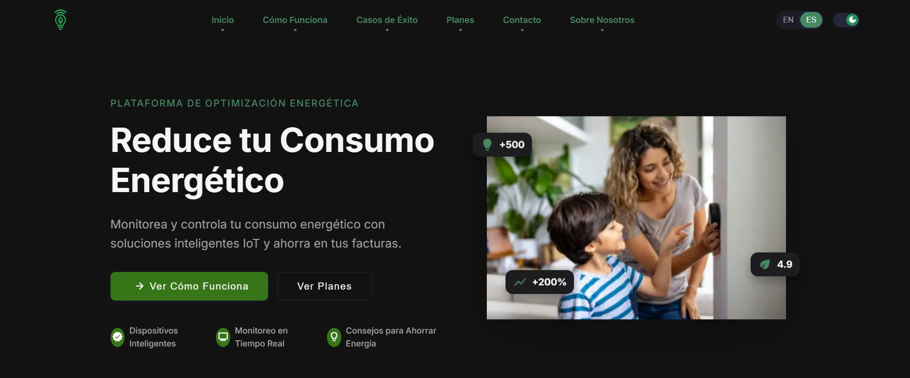
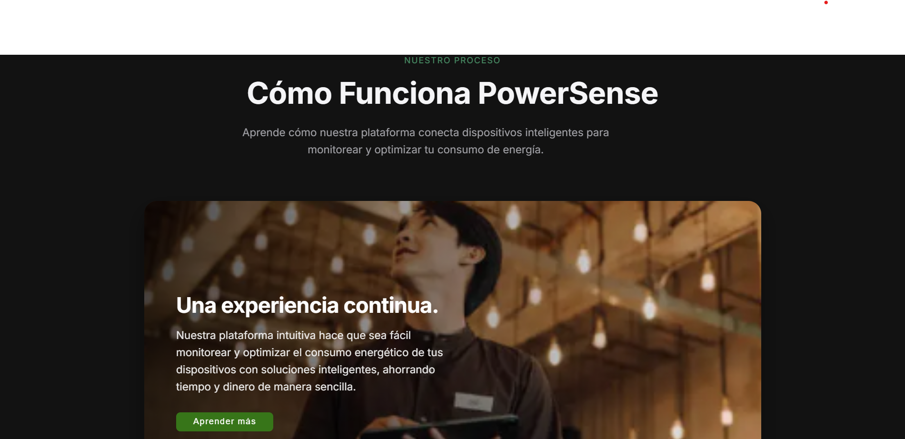

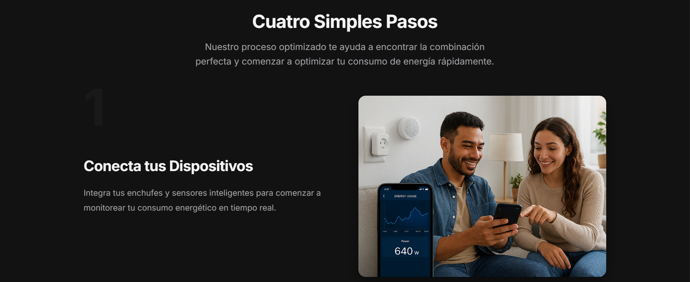
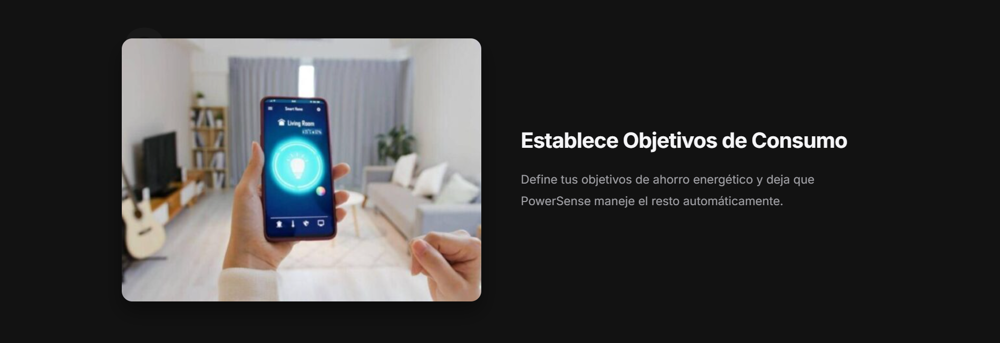
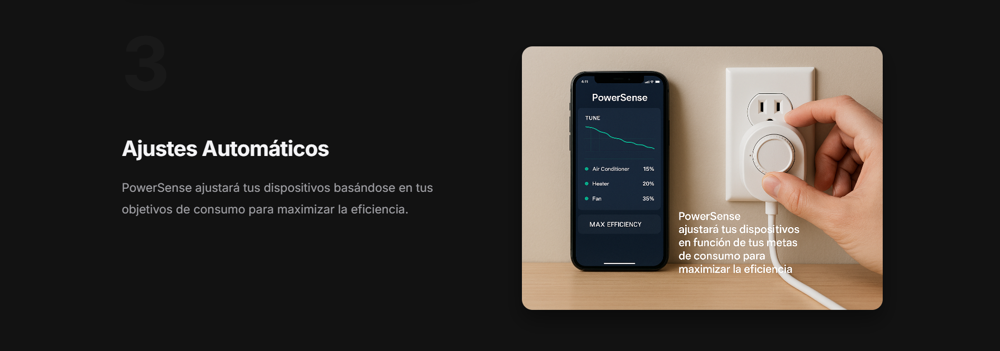
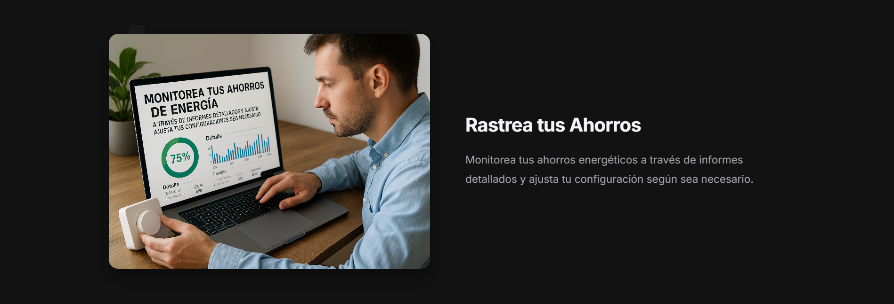
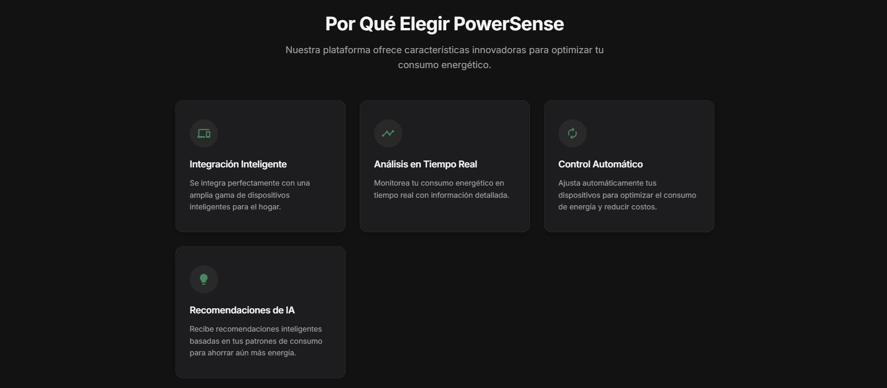
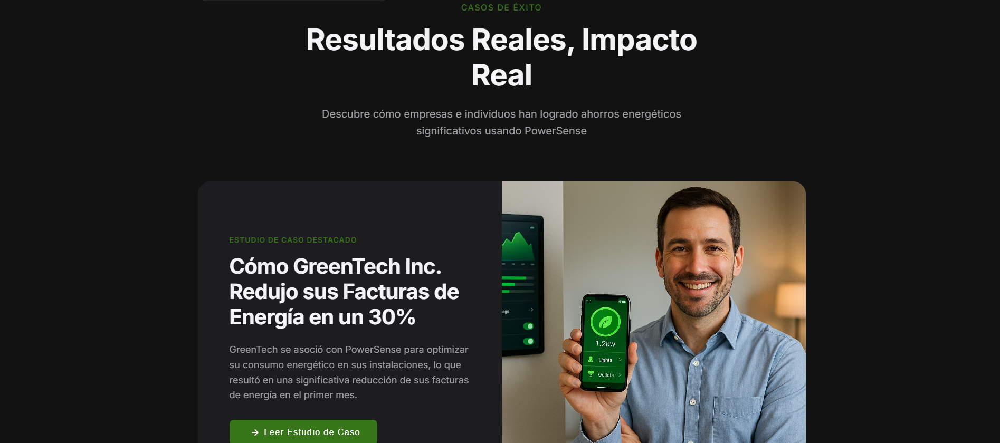
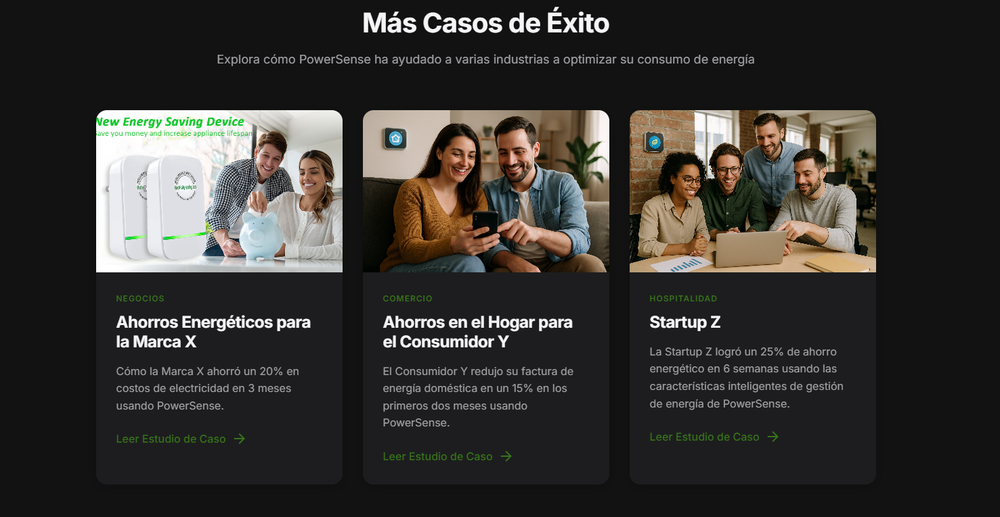
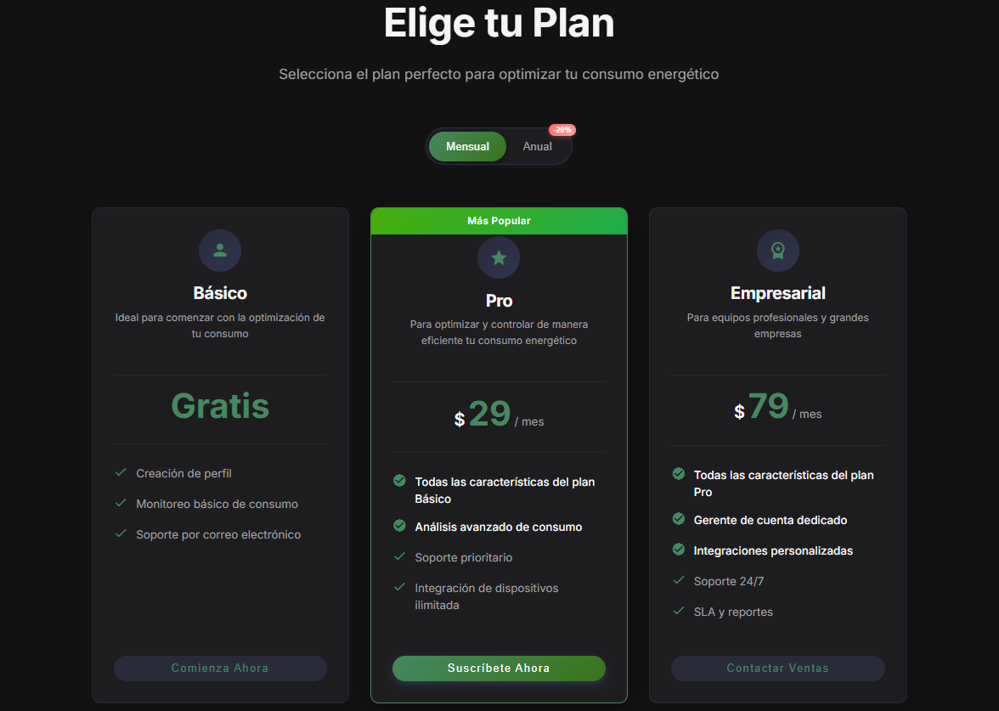
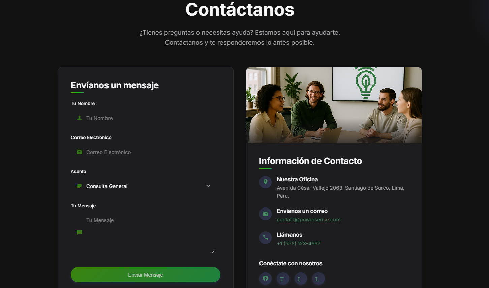
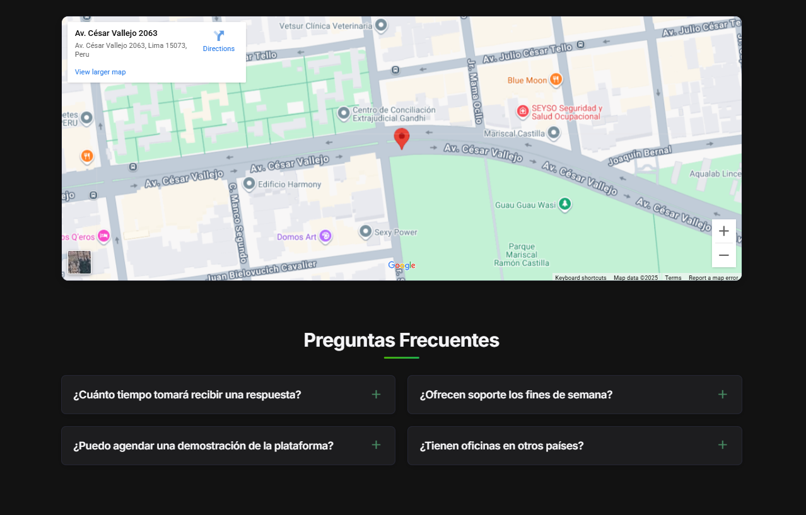
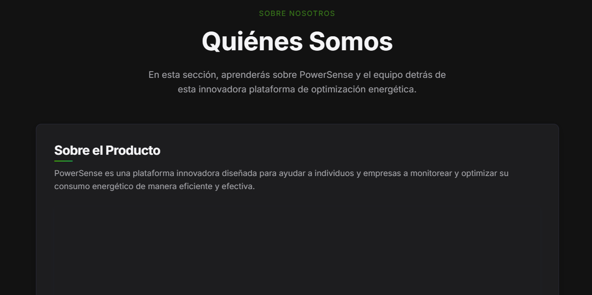


## 4.4. Web Applications UX/UI Design.
### 4.4.1. Web Applications Wireframes.

### 4.4.2. Web Applications Wireflow Diagrams.

### 4.4.2. Web Applications Mock-ups.

### 4.4.3. Web Applications User Flow Diagrams.

## 4.5. Web Applications Prototyping.

## 4.6. Domain-Driven Software Architecture.
### 4.6.1. Software Architecture Context Diagram.

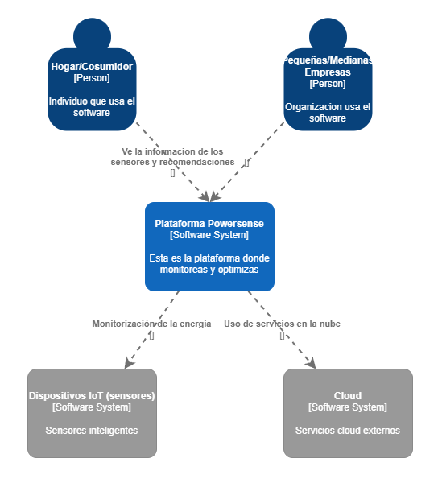

### 4.6.2. Software Architecture Container Diagrams.

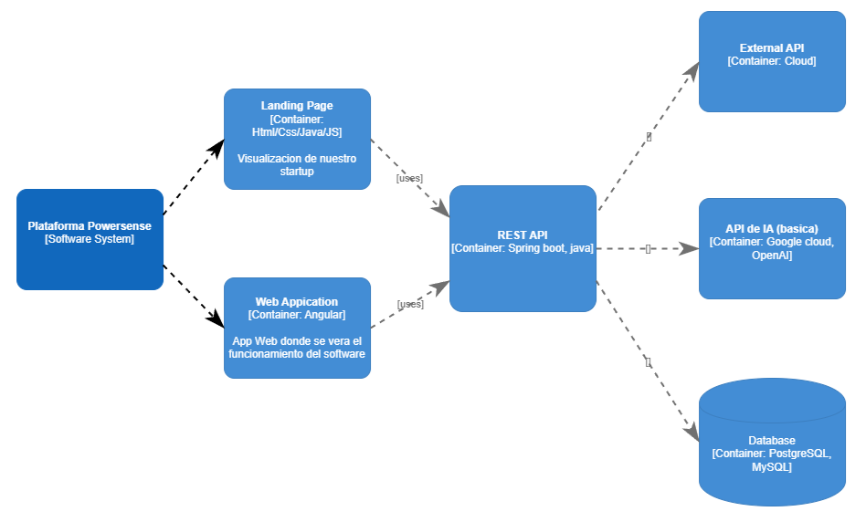

### 4.6.3. Software Architecture Components Diagrams.


## 4.7. Software Object-Oriented Design.
### 4.7.1. Class Diagrams.


### 4.7.2. Class Dictionary.

### a. User (Entity, Aggregate Root)

Descripción: Representa a un usuario de la plataforma (hogar o PYME). Es la raíz de agregado, pues controla los dispositivos y recomendaciones asociadas.

### Atributos:

- `userId: Long` → Identificador único del usuario.

- `name: String` → Nombre del usuario.

- `email: String` → Correo electrónico del usuario.

- `password: String` → Contraseña encriptada.

- `role: String` → Rol del usuario (ej. admin, cliente).

### Métodos:
No definidos directamente; se gestionan mediante AuthService.

### b. AuthService (Service)

Descripción: Servicio que gestiona la autenticación y autorización de los usuarios.

### Métodos:

- `login(email: String, password: String): User` → Permite que un usuario inicie sesión.

- `register(user: User): User` → Registra un nuevo usuario en el sistema.

- `logout(userId: Long): void` → Cierra sesión de un usuario.

### c. Device (Entity)

Descripción: Representa un dispositivo IoT conectado a la plataforma.

### Atributos:

- `deviceId: Long` → Identificador único del dispositivo.

- `name: String` → Nombre del dispositivo (ej. lámpara, refrigerador).

- `type: String` → Tipo de dispositivo (sensor, actuador).

- `status: String` → Estado actual (encendido/apagado).

- `location: String` → Ubicación física del dispositivo.

### d. DeviceService (Service)

Descripción: Servicio encargado de la gestión de dispositivos.

### Métodos:

- `addDevice(userId: Long, device: Device): Device` → Registra un nuevo dispositivo para un usuario.

- `removeDevice(deviceId: Long): void` → Elimina un dispositivo existente.

- `updateDevice(deviceId: Long, device: Device): Device` → Actualiza información de un dispositivo.

- `listDevices(userId: Long): List<Device>` → Obtiene la lista de dispositivos de un usuario.

### e. ConsumptionRecord (Entity, Value Object inside Aggregate Device)

Descripción: Registro histórico de consumo energético de un dispositivo.

### Atributos:

- `recordId: Long` → Identificador del registro.

- `deviceId: Long` → Identificador del dispositivo asociado.

- `timestamp: Date` → Momento en que se tomó la medida.

- `energyUsed: Double` → Cantidad de energía consumida (kWh).

### f. ConsumptionService (Service)

Descripción: Servicio encargado de obtener y analizar datos de consumo energético.

### Métodos:

- `getConsumption(userId: Long): List<ConsumptionRecord>` → Obtiene el historial de consumo de un usuario.

- `getRealTimeData(deviceId: Long): ConsumptionRecord` → Devuelve el consumo energético en tiempo real de un dispositivo.

### g. Schedule (Entity, Value Object inside Aggregate Device)

Descripción: Representa una programación de encendido/apagado para un dispositivo.

### Atributos:

- `scheduleId: Long` → Identificador único de la programación.

- `deviceId: Long` → Dispositivo asociado.

- `startTime: Date` → Hora de inicio de la acción.

- `endTime: Date` → Hora de fin de la acción.

- `action: String` → Acción a ejecutar (ej. encender, apagar).

### h. ScheduleService (Service)

Descripción: Servicio que gestiona las programaciones de dispositivos.

### Métodos:

- `createSchedule(schedule: Schedule): Schedule` → Crea una nueva programación.

- `deleteSchedule(scheduleId: Long): void` → Elimina una programación existente.

- `listSchedules(userId: Long): List<Schedule>` → Obtiene las programaciones asociadas a un usuario.

### i. Recommendation (Entity, Value Object inside Aggregate User)

Descripción: Representa una sugerencia de optimización energética generada para un usuario.

### Atributos:

- `recommendationId: Long` → Identificador de la recomendación.

- `userId: Long` → Usuario al que está dirigida.

- `message: String` → Mensaje con la recomendación.

- `timestamp: Date`→ Momento en que fue generada.

### j. RecommendationEngine (Service)

Descripción: Motor de IA que analiza patrones de consumo y genera recomendaciones.

### Métodos:

- `generateRecommendations(userId: Long): List<Recommendation>` → Genera una lista de recomendaciones personalizadas para un usuario.

### k. Database (Infrastructure Service)

Descripción: Capa de persistencia que gestiona la comunicación con la base de datos.

### Métodos:

- `save(entity: Object): void` → Guarda una entidad.

- `findById(id: Long): Object` → Busca una entidad por ID.

- `findAll(entity: String): List<Object>` → Recupera todas las instancias de un tipo de entidad.

- `delete(id: Long): void` → Elimina una entidad por ID.

## 4.8. Database Design.
### 4.8.1. Database Diagram.
